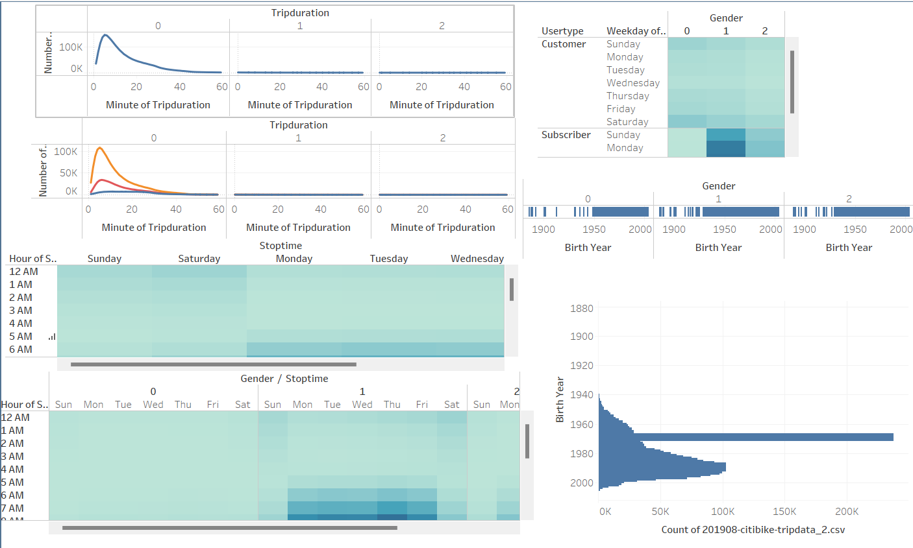

# bikesharing

## Overview
The purpose of this analysis was to create data visualizations which illustrated relationships between bike transportation data. 
## Results
The first analysis informs that most tripdurations last less than 1 hour with the most being around 1o minutes. The second line chart informs that most bikeriders are male. The third chart, the heatchart, shows that most of the bikerides happen during the weekdays around 8am and 5 pm. The fourth chart illustrates the same analysis as the previous heat chart but now filters by gender. Both genders ride around the same times during the same days. The fifth graph shows that there are much more subscribers than customers, but both ride at the same times of the day. 
## Summary
From the heat maps, it can be interpretted that most of the subjects in the data are riding to and from work. Hence, the weekdays are the most frequent days and 8am and 5pm are the most frequent times. From the two additional data visualizations with birth year constraints, it can be seen that the mode of riders were born in 1970 which means they are about 45 years old. This would agree with the previous interpretation of most subjects being people riding to work. 
